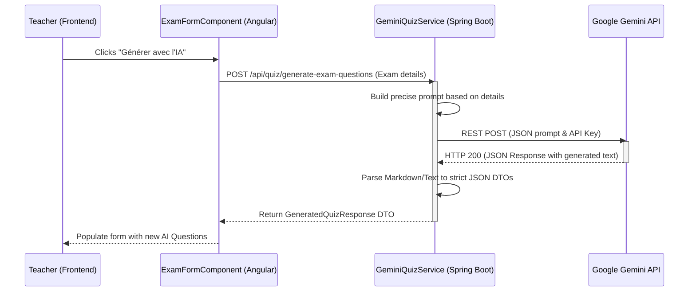
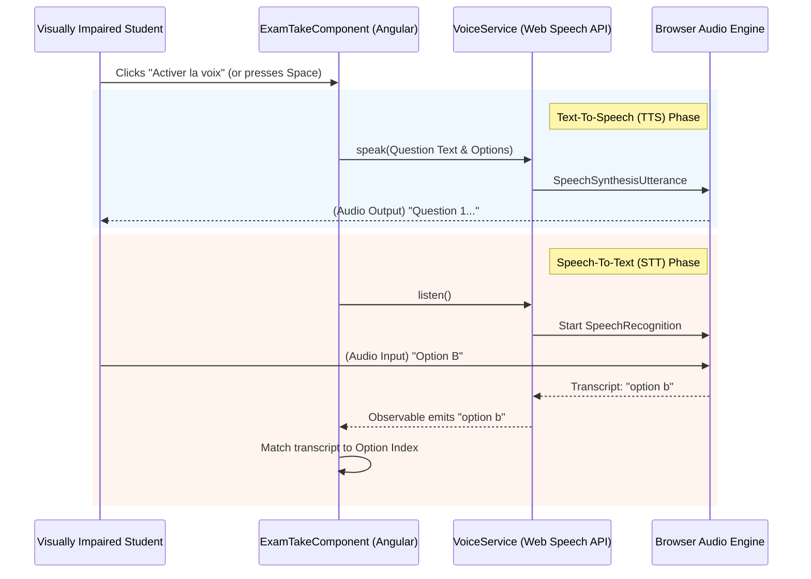

# LinguaNova AI & Accessibility Features

This document provides a technical overview and architectural breakdown of the AI-powered features and accessibility modules integrated into the LinguaNova platform.

## 1. AI-Powered Exam and Question Generation (Gemini API)

### 1.1 Overview
LinguaNova leverages Google's **Gemini 2.5 Flash** model to assist teachers in automatically generating quizzes and exam questions. This reduces the administrative burden on educators by providing highly relevant, curriculum-aligned questions based on simple parameters like course name, exam description, and difficulty.

### 1.2 Architecture Diagram



### 1.3 Technical Implementation Details

*   **Prompt Engineering**: The backend `GeminiQuizService` constructs a highly specific structural prompt. It explicitly instructs the LLM to act as an "English exam question generator" and demands that the output be a **single valid JSON object** matching a strict schema, without Markdown formatting or conversational text.
*   **JSON Parsing Resilience**: Since LLMs occasionally wrap JSON in markdown block quotes (e.g., ````json ... ````), the backend includes a preprocessing step to detect and strip these markdown fences before feeding the raw string to the Jackson `ObjectMapper`.
*   **Data Transformation**: The raw JSON parsed from Gemini is mapped into strongly typed Java DTOs (`GeneratedQuizResponse` and `GeneratedQuestionDto`). This ensures that the frontend only receives predictable, type-safe data that is ready to be directly mapped into the Angular Reactive Forms.

---

## 2. Voice Accessibility Module for Blind Students

### 2.1 Overview
To ensure LinguaNova is inclusive for visually impaired and blind students, a Voice Accessibility Module was developed. It provides hands-free operation during exam-taking by reading questions aloud (Text-to-Speech) and allowing students to seamlessly answer using their voice (Speech-to-Text).

### 2.2 Architecture Diagram



### 2.3 Technical Implementation Details

*   **Native Browser APIs**: The `VoiceService` is built entirely on the native HTML5 **Web Speech API** (`window.speechSynthesis` for TTS and `window.SpeechRecognition` / `webkitSpeechRecognition` for STT), removing the need for heavy third-party dependencies or paid API usage.
*   **Reactive Microphone Keep-Alive**: A standard browser `SpeechRecognition` instance automatically stops listening after a few seconds of silence. The `VoiceService` implements an intelligent **"Keep-Alive" loop** using an `_active` flag. If the `onend` event fires but the system still expects an answer, the microphone is silently rebooted (`recognition.start()`), providing an uninterrupted experience for the student.
*   **Fuzzy Matching**: Because Speech-to-Text transcripts aren't always perfect (e.g., hearing "to" instead of "two", or "tree" instead of "three"), the `ExamTakeComponent` converts all voice input to lowercase and strips whitespace before matching it against the available options, ensuring high reliability for spoken answers.
